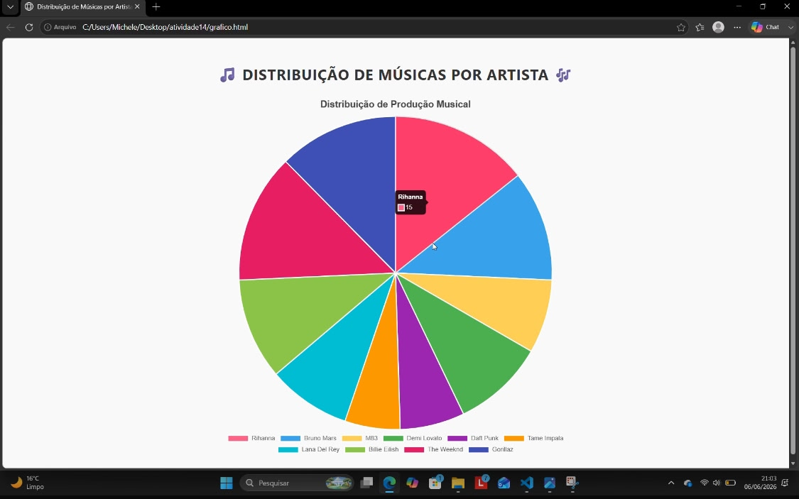
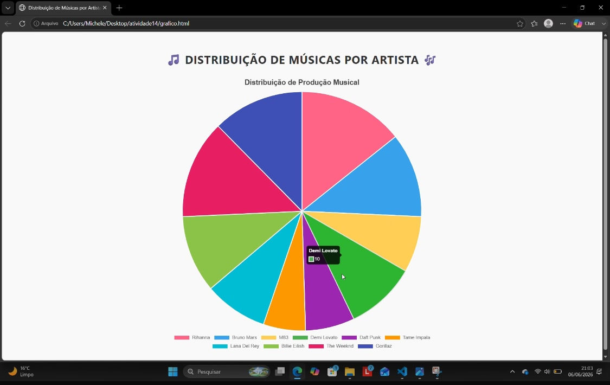

# Semana 14 - Atividade Prática  
**Apresentação dinâmica e avançada de dados**

## Aluna
- **Nome:** Michele Fortunato Lima  
- **Matrícula:** 928047  

## Proposta de Projeto
Apresentação dinâmica dos dados cadastrados na etapa anterior, utilizando a biblioteca **Chart.js** para criar um gráfico interativo que represente de forma clara e esteticamente agradável a distribuição de músicas por artista.

## Breve Descrição
Nesta atividade, desenvolvi uma página web que organiza e exibe dados em formato de **gráfico de pizza** usando **Chart.js**.  
O projeto trabalha com dados em JSON e mostra a distribuição de músicas entre diferentes artistas.  
A implementação reforça conceitos de:
- Manipulação de dados em estruturas JSON  
- Uso de bibliotecas externas (Chart.js)  
- Montagem dinâmica de páginas com JavaScript, HTML e CSS  

## Capturas de Tela

### 1. Exemplo com valores diferentes
  

### 2. Outro exemplo com dados alterados
  

## Tecnologias Utilizadas
- **JavaScript** (manipulação de dados e integração com Chart.js)  
- **HTML/CSS** (estrutura e estilo da página)  
- **Chart.js** (biblioteca para gráficos dinâmicos)  
- **JSON** (estrutura dos dados)  
- **Visual Studio Code** (editor de código)  
- **Git/GitHub** (controle de versão e entrega)  

## Versões
- **v1.0**: Ambiente inicial configurado  
- **v2.0**: Implementação da funcionalidade dinâmica com Chart.js  
- **v3.0**: Documentação final com prints no README.md  
